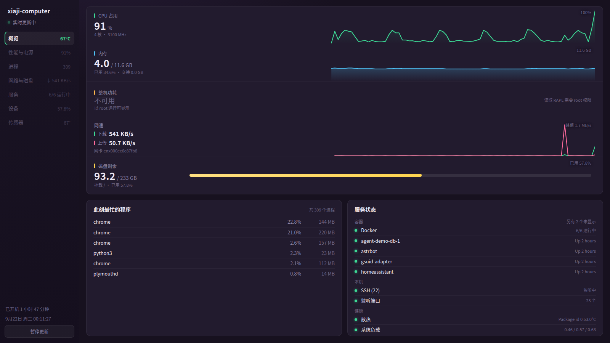

# 总控台 Dashboard

一个**零外部依赖**的本机状态看板：Python 标准库起的 HTTP 服务 + 原生前端，用浏览器实时查看这台机器的
CPU、内存、磁盘、网速、温度、进程与容器状态。

前端不引任何 CDN，后端除 `psutil` 外只用 Python 标准库，克隆下来一条命令就能跑。

<div align="center">
  
</div>

[](https://github.com/Xiaji-yu/dashboard/actions/workflows/ci.yml)
[](LICENSE)
[](https://www.python.org/)
[](requirements.txt)

## 特性

- **零依赖前端**：曲线、进度条、状态点全是手写 HTML/CSS/SVG，没有构建步骤，也不需要 npm。
- **移动端自适应**：窄屏下侧边栏折叠为吸顶顶栏（页签横向滑动），指标与卡片单列排布；
  切后台/锁屏自动暂停轮询，回前台立即刷新。
- **多页面（分批上线）**：前端为 hash 路由单页应用，页面模块按需加载；
  已上线「概览」「性能与电源」（每核占用、5 路温度、风扇转速、核显频率、内存构成、电池），其余页签先显示「建设中」。
- **采不到就说清楚**：任何指标采集失败都不会让页面崩，而是显示「不可用」+ 具体原因
  （例如 `读取 RAPL 需要 root 权限`）。
- **省流量的增量接口**：曲线数据走 `since` 游标，每秒只传新增的点，不是每次重传整窗口。
- **真实数据源**：`psutil` + `/proc/net/tcp{,6}` + `docker ps`，不依赖任何外部服务或云端。
- **可配置**：监听地址、端口、采样间隔、统计哪块网卡、看哪个挂载点都能用环境变量改。
- **有测试**：66 个 Python 用例覆盖采集、缓冲、接口契约与降级路径，另有 8 个前端图表用例
  守住曲线绘制；CI 里跑 ruff + 两套测试 + 接口冒烟。

## 截图

概览页（本项目的实际运行截图，非设计稿）：


## 快速开始

```bash
git clone https://github.com/Xiaji-yu/dashboard.git
cd dashboard

python3 -m venv .venv && source .venv/bin/activate   # 可选
pip install -r requirements.txt

./run.sh start        # 后台启动，日志写入 server.log
```

打开 <http://127.0.0.1:8282/>。默认监听 `0.0.0.0`，所以同网段的机器也能用
`http://<本机IP>:8282/` 访问。

其他命令：

```bash
./run.sh status       # 是否在跑 + 打印一段接口输出
./run.sh log          # 看日志
./run.sh stop         # 停止
./run.sh fg           # 前台运行，调试用
```

`run.sh` 用 `setsid` 启动服务，脱离当前会话/进程组——关掉终端或父进程被杀都不会带走它。

## 部署到 systemd（顺便解决功耗采集）

仓库里带了一个可直接用的服务单元：`deploy/dashboard.service`。

```bash
sudo cp deploy/dashboard.service /etc/systemd/system/dashboard.service
sudo editor /etc/systemd/system/dashboard.service   # 改 User= 和路径
sudo systemctl daemon-reload
sudo systemctl enable --now dashboard
systemctl status dashboard
```

**关于功耗采集**：`/sys/class/powercap/intel-rapl*/energy_uj` 默认是 `0400 root root`，
所以以普通用户运行的服务读不到，页面上会显示「不可用」。有两种开权限的方式：

1. **服务单元里的 `ExecStartPre`（默认已写好，推荐）**：systemd 以 root 身份在启动时执行一次
   `chmod 0444 /sys/class/powercap/intel-rapl*/energy_uj`，服务进程本身仍是普通用户。
2. **udev 规则（备选）**：`deploy/60-dashboard-rapl.rules`，装好后每次设备出现都会放开读权限：

   ```bash
   sudo cp deploy/60-dashboard-rapl.rules /etc/udev/rules.d/
   sudo udevadm control --reload-rules && sudo udevadm trigger --subsystem-match=powercap
   ```

   验证（普通用户，能打印数字即可）：`cat /sys/class/powercap/intel-rapl:0/energy_uj`

**不建议把看板本身跑成 root**：服务监听 `0.0.0.0` 且无鉴权，一旦被访问就能拿到 root 进程的
全部能力。上面两种方式都只把「读功耗计数器」这一件事放开。

有权限后能采到的功耗域（这台 i5-7200U 的实测）：

| 域 | 含义 | 角色 |
| --- | --- | --- |
| `psys` | 平台功耗 | 主值（最接近整机） |
| `package-0` | CPU 封装 | 明细行 |
| `core` | CPU 核心 | 明细行 |
| `uncore` | 核显与内存控制器 | 明细行 |
| `dram` | 内存 | 明细行 |

没有 RAPL 权限时不会空着：性能页的功耗卡退化为显示风扇转速，概览页的功耗曲线显示「不可用」并给出原因。

## 配置

全部通过环境变量，无需改代码：

| 变量 | 默认值 | 说明 |
| --- | --- | --- |
| `DASHBOARD_HOST` | `0.0.0.0` | 监听地址；改成 `127.0.0.1` 则只允许本机访问 |
| `DASHBOARD_PORT` | `8282` | 监听端口 |
| `DASHBOARD_INTERVAL` | `1.0` | 采样间隔（秒） |
| `DASHBOARD_NIC` | 自动挑选 | 指定统计哪块网卡，如 `eth0` |
| `DASHBOARD_DISK` | `/` | 指定统计哪个挂载点 |

```bash
DASHBOARD_PORT=9000 DASHBOARD_HOST=127.0.0.1 ./run.sh start
```

## 接口

| 接口 | 说明 |
| --- | --- |
| `GET /` | 看板页面 |
| `GET /api/overview` | 瞬时快照：全部指标 + 最忙进程 Top6 + 服务状态 |
| `GET /api/series` | 曲线数据（最近 120 秒全窗口） |
| `GET /api/series?since=<ts>` | 增量曲线数据，只返回比 `ts` 新的点 |

采样线程每秒采一次并写入环形缓冲，所以**页面随时打开都有历史曲线**，不需要等数据积累。

```console
$ curl -s localhost:8282/api/overview | python3 -m json.tool | head -12
{
  "ts": 1790007212.11,
  "host": "xiaji-computer",
  "cores": 4,
  "uptime_s": 6583.11,
  "cpu": { "available": true, "percent": 34.1, "freq_mhz": 3100 },
  ...
}
```

## 指标口径

上半部分是 5 条「数字 + 曲线」指标：

| 指标 | 采集方式 | 说明 |
| --- | --- | --- |
| CPU 占用 | `psutil.cpu_percent()` | 固定 0–100 量程；副标题显示核心数与实时频率 |
| 内存 | `psutil.virtual_memory()` | 已用 / 总量，副标题带交换区 |
| 整机功耗 | Intel RAPL `energy_uj` 差分 | `energy_uj` 通常仅 root 可读，普通用户下显示「不可用」 |
| 网速 ↓↑ | `psutil.net_io_counters()` 差分 | **只统计物理网卡**，docker 的 `br-*`/`veth`/`docker0` 不计入 |
| 磁盘剩余 | `psutil.disk_usage()` | 条形图按已用比例填充 |

下半部分：

- **此刻最忙的程序**：按 CPU 排序 Top6。CPU 值按逻辑核心数归一化到 0–100，口径贴近 macOS 活动监视器；
  `top`/`ps` 的原始值最高可达 `100 × 核心数`，因此**顺序一致、数值约为其 1/核心数**。
- **服务状态**：分「容器 / 本机 / 健康」三组
  - 容器：`docker ps -a`（5 秒缓存），最多列 4 个，其余折叠成「另有 N 个未显示」
  - 本机：SSH 是否在听、监听端口总数（读 `/proc/net/tcp{,6}`，免 root）
  - 健康：CPU 温度（`psutil.sensors_temperatures()`）、系统负载（`os.getloadavg()`）

## 安全提示

当前定位是**本机 / 内网自用，仍在测试阶段**，没有暴露公网；**鉴权尚未实现**（在路线图里，
见 `CHANGELOG.md`）。下面是「将来要放给更大范围访问」时的注意事项：

**本项目不包含任何身份验证**，任何能连上端口的人都能看到主机名、IP、进程名、容器名和端口清单。

- 只在可信网络里监听 `0.0.0.0`；不确定就用 `DASHBOARD_HOST=127.0.0.1` 配合 SSH 隧道：
  ```bash
  ssh -L 8282:127.0.0.1:8282 user@server
  ```
  然后本地打开 <http://127.0.0.1:8282>。
- 不要把端口直接映射到公网。若必须公网访问，请放在带认证的反向代理后面。

详见 [SECURITY.md](SECURITY.md)。

## 开发

```bash
pip install -r requirements-dev.txt

python3 -m unittest discover -v      # 66 个 Python 用例，约 1 秒
node tests/chart.test.js             # 8 个前端图表用例（不需要浏览器）
ruff check .                         # 代码风格（行宽 120，规则集 E/F/W）
./run.sh fg                          # 前台跑起来看效果
```

测试用标准库 `unittest` 编写，因此**不装 pytest 也能跑**；pytest 同样可以直接收集。
图表用例用 Node 直接桩出最小 DOM 跑 `static/chart.js`，覆盖「重复点/时间断层不能连成直线」这类
只在浏览器里才暴露的问题。
接口测试在 `127.0.0.1` 的空闲端口上真起一个服务（`port=0` 交给内核分配），
所以不会和在跑的 8282 抢端口，也不依赖网络。

代码风格：注释与文档字符串用中文，行宽上限 120（CJK 注释较宽）。贡献流程见 [CONTRIBUTING.md](CONTRIBUTING.md)。

## 目录结构

```
dashboard/
├── server.py              # HTTP 服务、路由、JSON 接口
├── collector.py           # 指标采集（psutil + /proc + docker + hwmon），含降级处理
├── history.py             # 曲线用的时序环形缓冲
├── static/
│   ├── index.html         # 单页应用骨架（hash 路由）
│   ├── style.css          # 深色主题（含移动端断点）
│   ├── chart.js           # 手绘 SVG 折线图
│   ├── app.js             # 前端核心：路由、徽章轮询、公共工具
│   └── pages/             # 页面模块（概览、性能与电源……）按需加载
├── tests/                 # Python 用例 + chart.test.js（Node 前端图表用例）
├── deploy/                # systemd 服务单元与 RAPL 权限 udev 规则
├── docs/
│   ├── screenshot.png     # 本项目运行截图
│   └── reference/         # UI 参考图（见该目录 README）
├── run.sh                 # 启停脚本
└── pyproject.toml         # 仅放 pytest / ruff 配置（本项目不做打包分发）
```

## 设计来源与差异

UI 结构参考了一组 macOS 系统监控面板的截图（见 `docs/reference/`），本项目按 Linux 的实际能力做了取舍：

1. **概览页去掉 MacBook 示意图整块**（含环境光、屏幕张开角度），上半部分改为 5 条指标曲线铺满全宽。
2. **性能与电源页尽量贴近参考图版式**：上半部分一张大卡（左侧大数字 + 按物理核分组的占用条 + GPU 频率，
   右侧 2 分钟大曲线与图例），下半部分三张并排小卡（温度 / 功耗与风扇 / 内存构成）。
   参考图的「能效核心 / 性能核心」分组在本机（i5-7200U，无大小核）退化为「按物理核心分组」。
3. Mac 专有指标（环境光、屏幕张开角度）在 Linux 上不存在，不显示；**电池反而能采到**——
   本机是笔记本，电量/接通状态/循环次数来自 sysfs 与 psutil。
4. 参考图的 GPU 占用率没有 Linux 通用接口，改为显示核显频率（`gt_cur_freq_mhz` + 最大值）。
5. 参考图的功耗卡按本机能力改写为「功耗与风扇」：RAPL 需 root，无权限时如实显示不可用并给出原因，
   有权限时显示整机瓦数；风扇转速作为该卡的大数字。
6. 参考图左下角的「关闭总控台」改为「暂停更新」：服务监听 `0.0.0.0` 且无鉴权，
   不做能被同网段任意触发的关机接口。
7. 参考图里的外网探测（腾讯云 / AWS / 百度延迟）留到「服务」页，做成可配置的 TCP 探测列表。
8. 曲线历史窗口与参考图一致，为最近 2 分钟。

## 已知限制

- 无鉴权（见上）。
- 曲线历史只存在内存里，服务重启后重新累积（最多 1200 点 / 约 20 分钟）。
- 功耗依赖 Intel RAPL 且需要 root，多数桌面环境会显示「不可用」（性能页会给出原因）。
- 容器面板每 5 秒执行一次 `docker ps`；docker 卡住时最多影响该面板状态。
- 前端页面分批上线：目前完成「概览」与「性能与电源」，其余页签显示「建设中」。

## 许可证

[MIT](LICENSE)。`docs/reference/` 下的参考图不随该许可证授权，详见其目录内说明。
